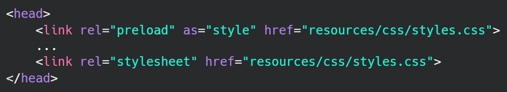
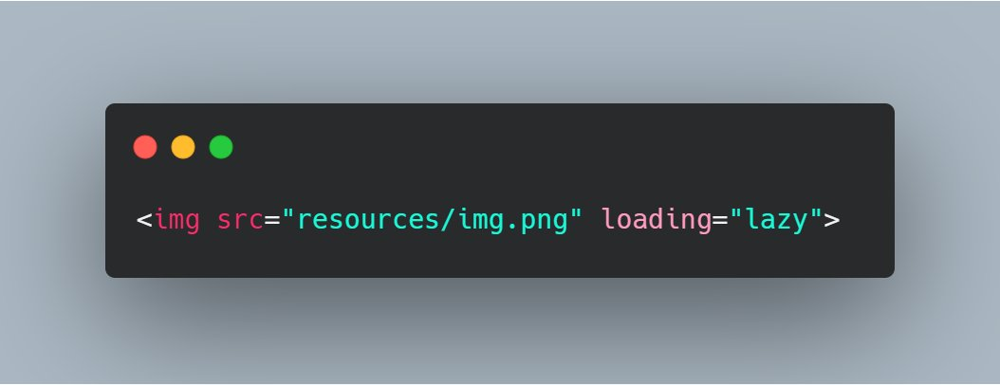
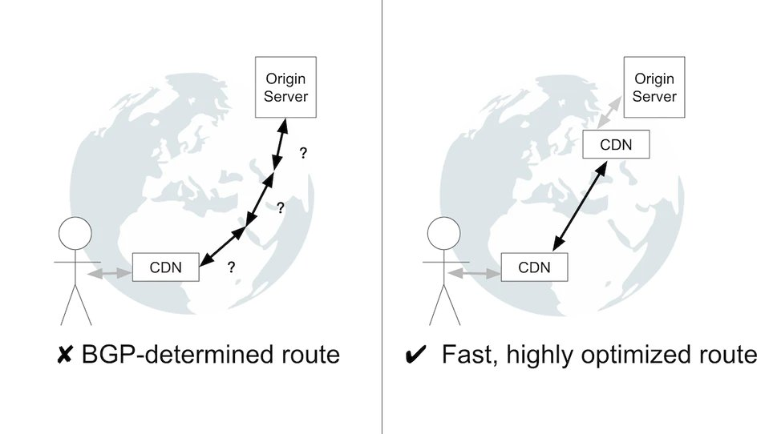

<h1>47% of website visitors quit if the website doesn't load within 5 seconds.

Here are a few tips to reduce load times.</h1>

# 6 tips to reduce load times of your webpages.
## 1: Preload CSS
At the top of the head tag, keep a link referring to the CSS file with rel attribute as `preload`.

Then have a link with rel as `stylesheet` to apply the CSS.

This makes the CSS file available as soon as its required for the rendering of the page later on.

## 2: Preconnect to resources

It tells the browser to create a connection to the link in advance and makes it aware that you might fetch images or data from this URL.

## 3: Lazy load the media

The loading attribute specifies whether a browser should load an image immediately or to defer loading of off-screen images until the user scrolls near them.

## 4: Use a CDN to load images faster

Content Delivery Networks cache the media in their world-wide spread server networks and serve the images to the client from the nearest server.

## 5: Minify your CSS files to reduce size

Indentation and spaces in code are for human readability but browsers don't need it.

[Minify](https://web.dev/minify-css/) your files using a bundler such as webpack or rollup to reduce your file size. 

